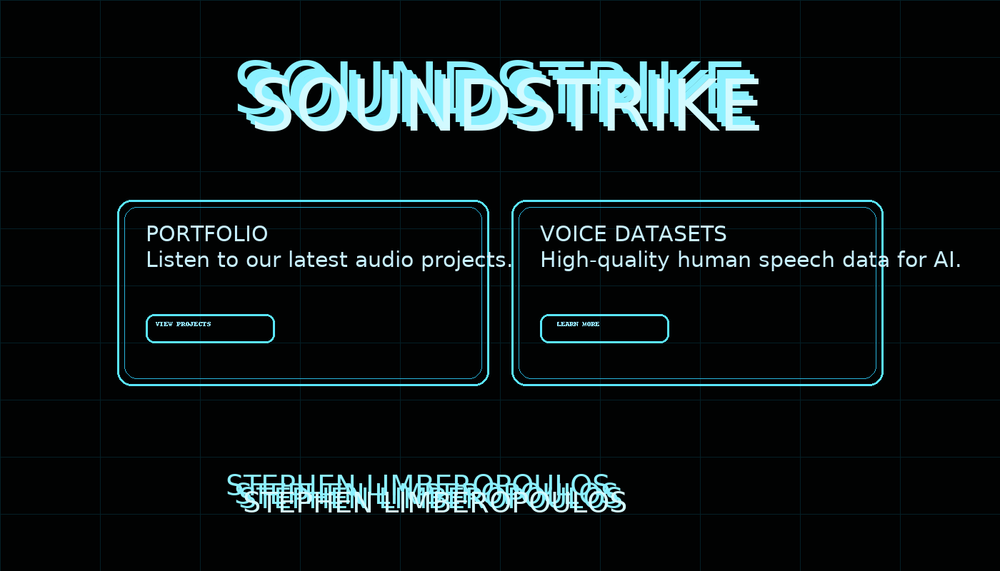

# Soundstrike Website

**Summary:** Deploys the approved neon/cyber homepage on GitHub Pages at **soundstrike.ai**.

**Description:**  
Two-panel landing page with circuit-texture background. Left card: **PORTFOLIO** (“Listen to our latest audio projects”) with inset **VIEW PROJECTS** button. Right card: **VOICE DATASETS** (“High‑quality human speech data for AI”) with **LEARN MORE** button. Top title **SOUNDSTRIKE**; footer shows **STEPHEN LIMBEROPOULOS** centered in neon blue. Hover-only glow interactions, plus subtle UI SFX (title, buttons, name, and cards).

**Deploy notes**
- Keep `CNAME` at repo root with `soundstrike.ai`
- Pages → Source = your branch `/ (root)`; check **Enforce HTTPS**
- DNS: `@` A/ALIAS to GitHub Pages IPs shown in Pages, `www` CNAME to your `username.github.io`
